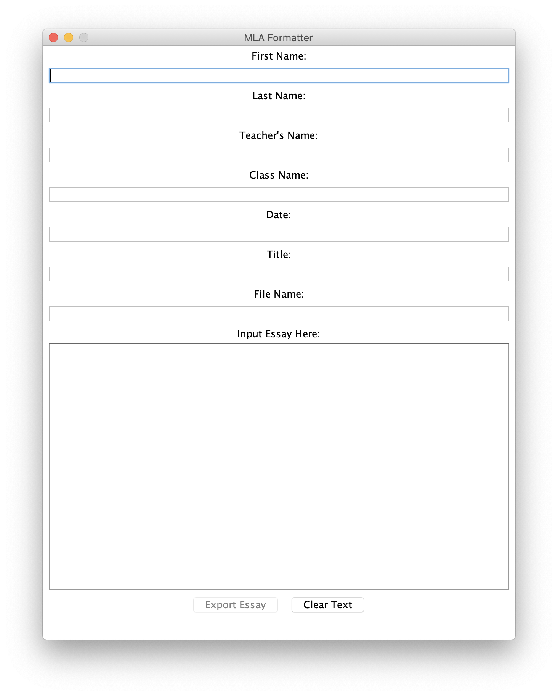

# MLA-Formatter
This is a project from high school that takes user input text and returns a Microsoft Word Document with the text formatted in MLA format. Its a simple Java app that uses the [Apache POI Java API](https://poi.apache.org/). At some point I lost my original code, but still had a working JAR file, so I used the IntelliJ decompiler to get the source code back. 

Menu: 